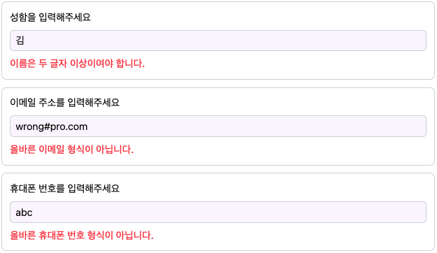
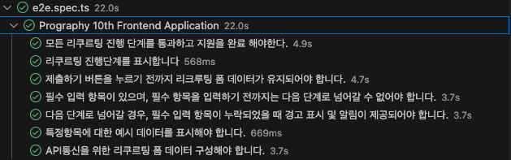

# Prography-10th-frontend

## 요구사항

- [x] 1. 리쿠르팅 **진행단계**를 표시합니다.
- [x] 2. 제출하기 버튼을 누르기 전까지 리크루팅 **폼 데이터가 유지**되어야 합니다.
- [x] 3. 필수 입력 항목이 있으며, 필수 항목을 입력하기 전까지는 다음 단계로 넘어갈 수 없어야 합니다.
- [x] 4. 다음 단계로 넘어갈 경우, 필수 입력 항목이 누락되었을 때 **경고 표시 및 알림**이 제공되어야 합니다.
- [x] 5. 특정항목에 대한 **예시 데이터**를 표시해야 합니다.
- [x] 6. API통신을 위한 리쿠르팅 **폼 데이터** 구성해야 합니다.
- [x] 7. 이 외에도 UI/UX적으로 필요한 기능이 있다면 **자유롭게 추가**해 주세요.

## 확인방법

### 1. 배포 url

- <https://prography-10th-frontend-pi.vercel.app/>

### 2. 로컬기동

- Node.js v14 이상 설치 후

```sh
npm i
npm run dev
```

- 브라우저에서 <http://localhost:5173/> 접속

### 3. e2e 테스트 수행

- `2. 로컬기동` 한 상태에서 별로 터미널 세션에서 아래 명령어 실행

```sh
npm run test
```

## 추가구현

- [x] View Transition API 를 활용하여 진행단계 변화 시 fade in/out 효과 구현


[animatedNavigate.ts](./src/utils/animatedNavigate.ts)

```typescript
document.startViewTransition(() =>
  flushSync(() =>
    dispatch({
      type: ApplyActionType.UPDATE_PROGRESS,
      payload,
    }),
  ),
);
```

- [x] View Transition 을 커스텀하여 carousel 형태의 리크루팅 폼 단계 전환


[animatedNavigate.ts](./src/utils/animatedNavigate.ts)

```typescript
export default function animatedNavigate(
  direction: "next" | "back",
  progress: number,
  dispatch: Dispatch<ApplyAction>,
) {
  const payload = direction === "next" ? progress + 1 : progress - 1;

  const style = document.createElement("style");
  style.id = "view-transition-style";
  style.innerHTML = `::view-transition-old(view-apply-form) {
  animation: ${direction}SlideOut 1s;
}
::view-transition-new(view-apply-form) {
animation: ${direction}SlideIn 1s;
}`;

  document.head.appendChild(style);

  // document.startViewTransition(() =>
  //..
}
```

- [x] tailwind animation 을 각 button 및 아이콘에 적용

[Home.tsx](./src/pages/Home.tsx)

```typescript
<Link
    to="/apply"
    className="animate-pulse rounded-md bg-blue-500 px-6 py-2 text-white hover:animate-none"
>
    지원하기
</Link>
```

- [x] Context API 를 활용하여 form data 를 global state 로 관리

[ApplyProvider.tsx](./src/providers/ApplyProvider.tsx)

```typescript
export const ApplyContext = createContext<{
  state: ApplyState;
  dispatch: React.Dispatch<ApplyAction>;
}>({
  state: initialApplyState,
  dispatch: () => null,
});

export default function ApplyProvider({
  children,
}: {
  children: React.ReactNode;
}) {
  const [state, dispatch] = useReducer(applyReducer, initialApplyState);

  return (
    <ApplyContext.Provider value={{ state, dispatch }}>
      {children}
    </ApplyContext.Provider>
  );
}
```

- [x] useReducer를 활용하여 global state 에 대한 유형별 액션 정의

[ApplyProvider.tsx](./src/providers/ApplyProvider.tsx)

```typescript
export function applyReducer(
  state: ApplyState,
  action: ApplyAction,
): ApplyState {
  switch (action.type) {
    case ApplyActionType.UPDATE_PROGRESS:
      return { ...state, progress: action.payload };
    case ApplyActionType.UPDATE_CONSENT:
      return { ...state, form: { ...state.form, consent: action.payload } };
    case ApplyActionType.UPDATE_PERSONAL:
      return {
        ...state,
        form: {
          ...state.form,
          name: action.payload.name,
          email: action.payload.email,
          phone: action.payload.phone,
        },
      };
    case ApplyActionType.UPDATE_ROLE:
      return { ...state, form: { ...state.form, role: action.payload } };
  }
}
//..
const [state, dispatch] = useReducer(applyReducer, initialApplyState);
```

- [x] `react-hook-form` 을 사용하지 않고 `useActionState` 만을 활용하여 form submit 처리

[Apply.tsx](./src/pages/Apply.tsx)

```typescript
const [state, action] = useActionState(applyHandler.handleSubmit, null);
//..
    <form action={action} className="flex flex-col justify-around gap-5">
//..
```

- [x] zod 라이브러리를 사용하여 폼 데이터 유효성 검사 및 에러 메시지 표시



[formSchema.ts](./src/schemas/formSchema.ts)

```typescript
export const consentSchema = z.object({
  consent: z.literal("true", {
    errorMap: () => ({ message: "개인정보 수집에 동의해주세요." }),
  }),
});

export const personalSchema = z.object({
  name: z.string().min(2, "이름은 두 글자 이상이여야 합니다."),
  email: z.string().email("올바른 이메일 형식이 아닙니다."),
  phone: z
    .string()
    .regex(
      /^((010-?\d{4})|(0\d{1,2}-?\d{3,4}))-?\d{4}$/,
      "올바른 휴대폰 번호 형식이 아닙니다.",
    ),
});

export const roleSchema = z.object({
  role: z.nativeEnum(Role, {
    errorMap: () => ({ message: "역할을 선택해주세요." }),
  }),
});
```

- [x] vercel 을 통한 배포

  - <https://prography-10th-frontend-pi.vercel.app/>

- [x] e2e 테스트 추가

  - 모든 요구사항에 대한 test case 추가 완료

    

- [x] Replace Conditional with Polymorphism
  - 각 진행 단계에 따른 apply form 에 대한 component 렌더링과 handleSubmit 을 조건문 없이 다형성을 활용하여 구현

[ApplyHandler.ts](./src/handlers/ApplyHandler.ts)

```ts
export abstract class ApplyHandler {
  progress: Progress;
  form: IForm;
  dispatch: React.Dispatch<ApplyAction>;
  navigate: NavigateFunction;

  constructor(
    progress: Progress,
    form: IForm,
    dispatch: React.Dispatch<ApplyAction>,
    navigate: NavigateFunction,
  ) {
    this.progress = progress;
    this.form = form;
    this.dispatch = dispatch;
    this.navigate = navigate;
  }

  abstract renderContent(fieldErrors: FieldErrors): JSX.Element;
  abstract handleSubmit(
    _: unknown,
    data: FormData,
  ): Promise<
    | typeToFlattenedError<
        {
          consent: "true";
        },
        string
      >
    | typeToFlattenedError<
        {
          name: string;
          email: string;
          phone: string;
        },
        string
      >
    | typeToFlattenedError<
        {
          role: string;
        },
        string
      >
    | undefined
  >;
}
```

[createApplyHandler.ts](./src/handlers/createApplyHandler.ts)

```ts
export default function createApplyHandler(
  progress: Progress,
  form: IForm,
  dispatch: React.Dispatch<ApplyAction>,
  navigate: NavigateFunction,
): ApplyHandler {
  const handlers = {
    [Progress.One]: OneHandler,
    [Progress.Two]: TwoHandler,
    [Progress.Three]: ThreeHandler,
  };

  const Handler = handlers[progress];
  return new Handler(progress, form, dispatch, navigate);
}
```
